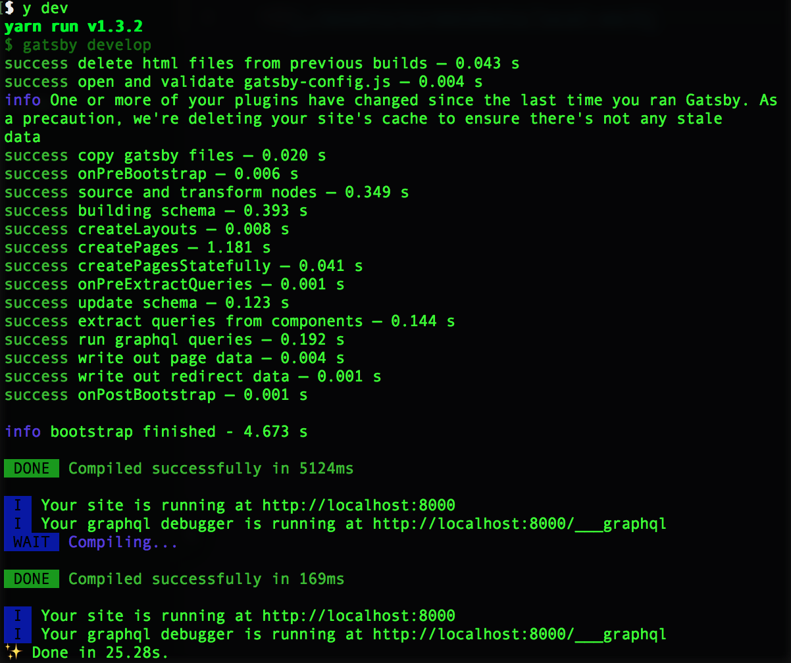
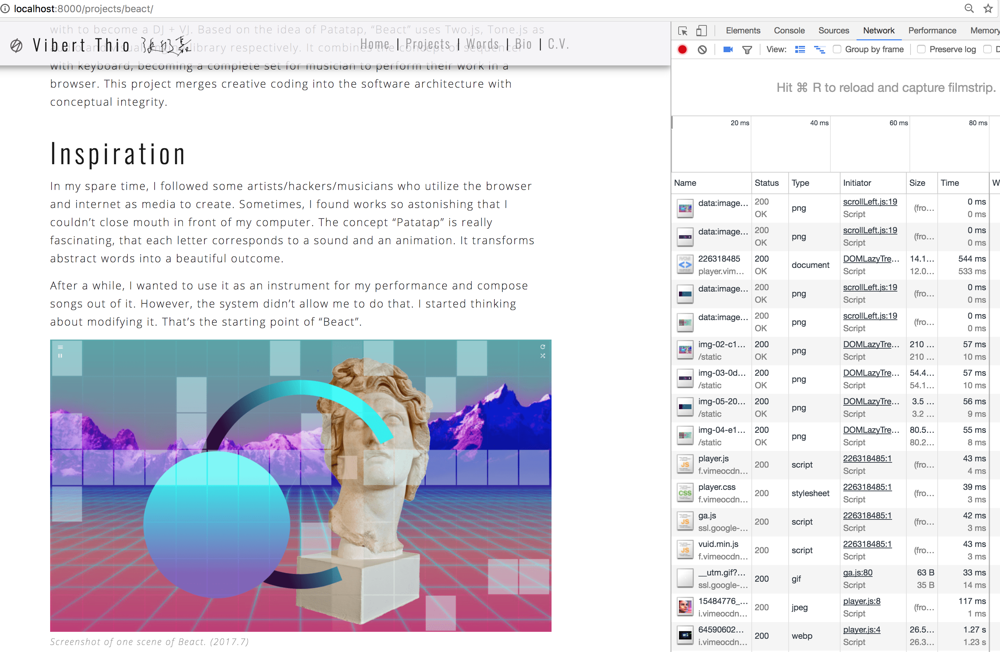
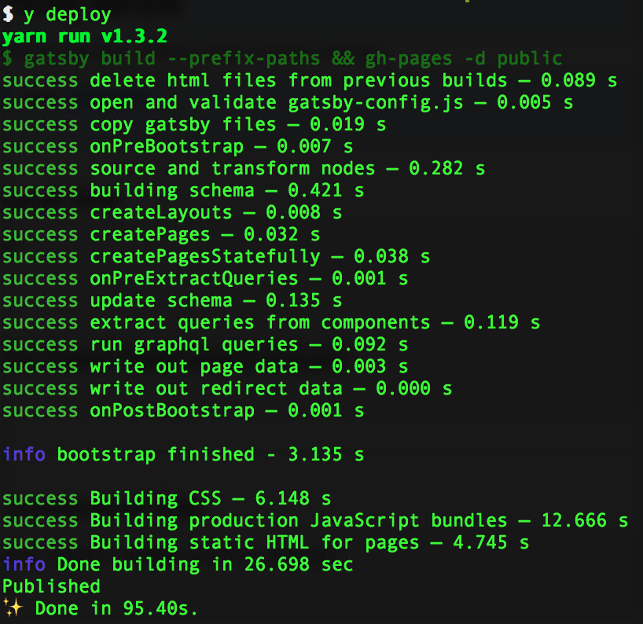
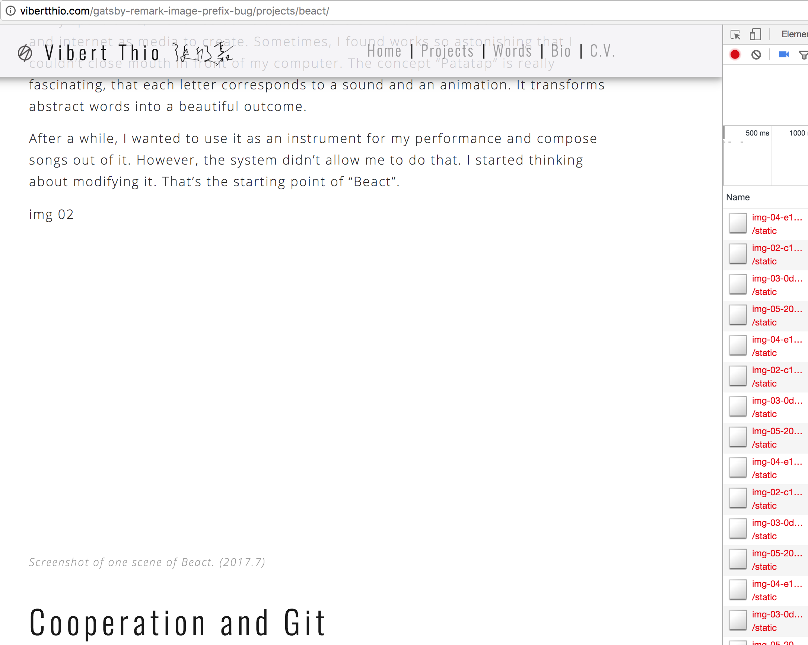
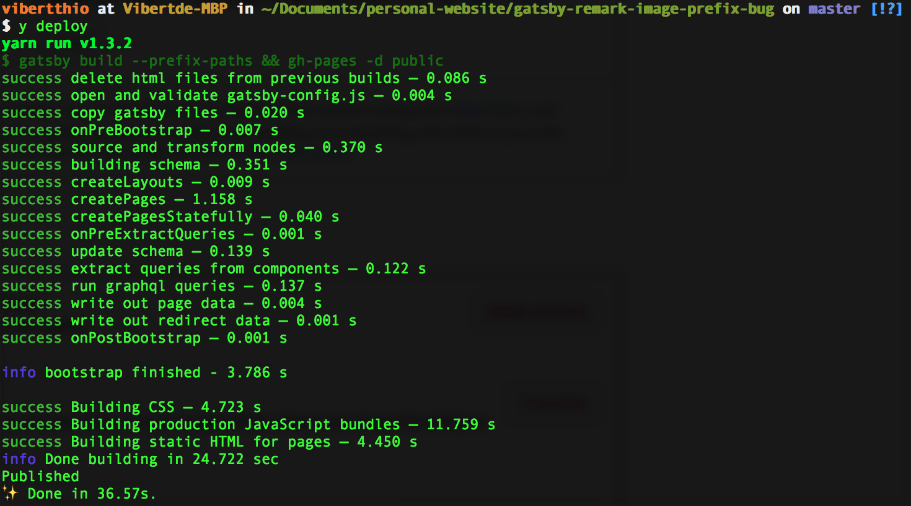
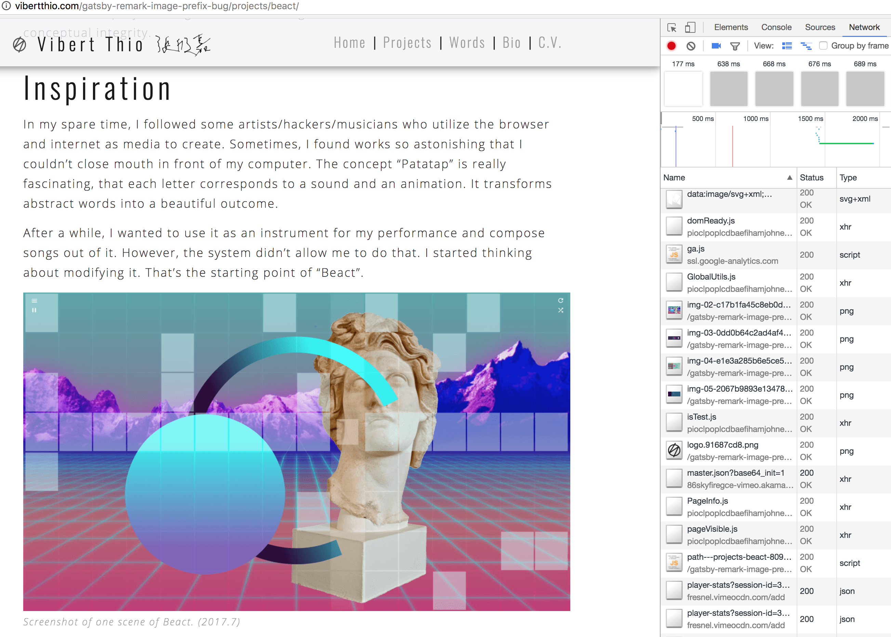
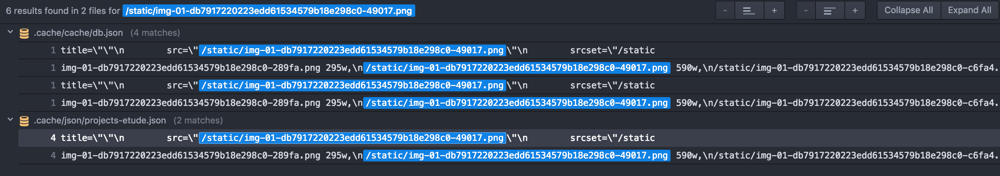

# gatsby-remark-image-prefix-bug
[demo](http://vibertthio.com/gatsby-remark-image-prefix-bug/)

  

## dev in local: work

  

## deploy to gh-pages: wrong prefix

  

## deploy after clean cache: work

  

## other evidence

After deploying to the gh-pages, I can only find the url without prefix in the cache folder.
Therefore, I think the wrong url of images in markdown of deployment comes from cache.

